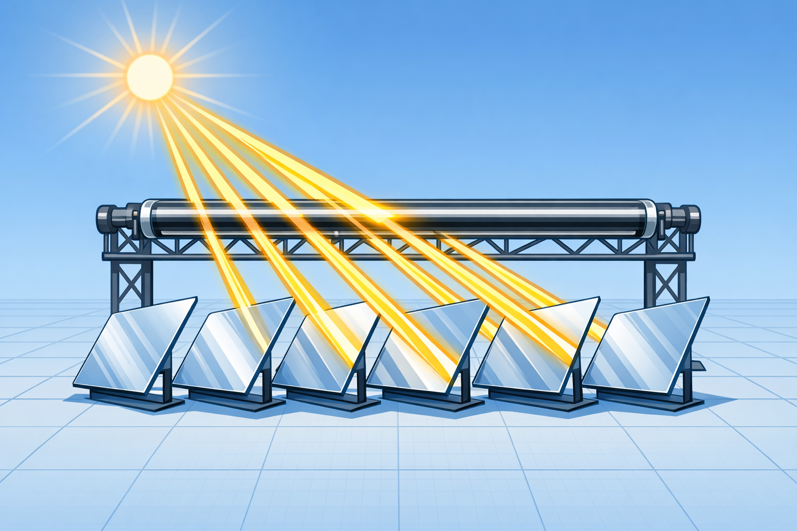
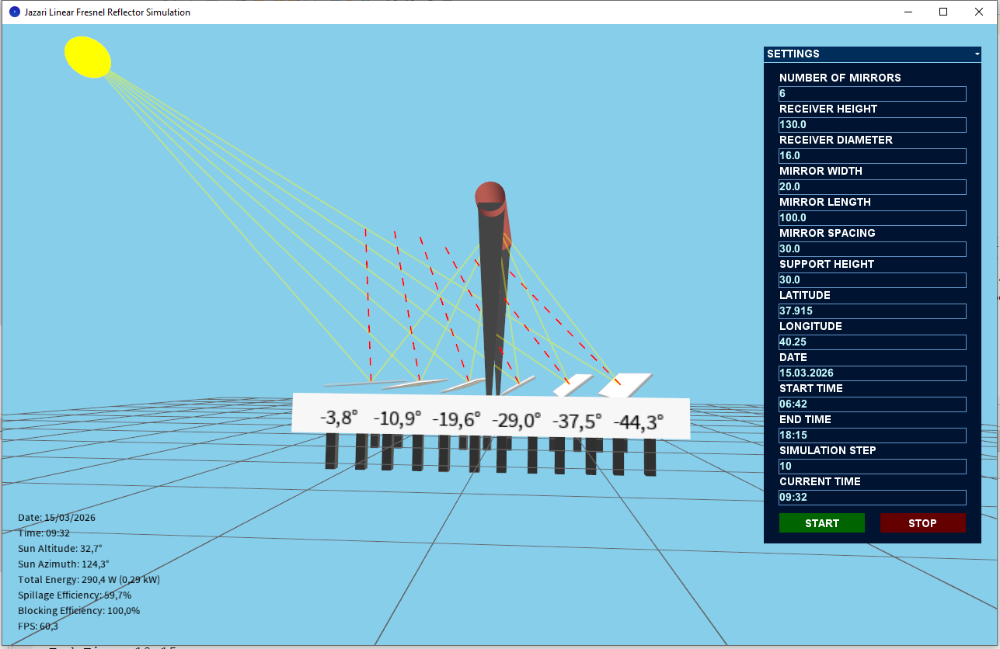
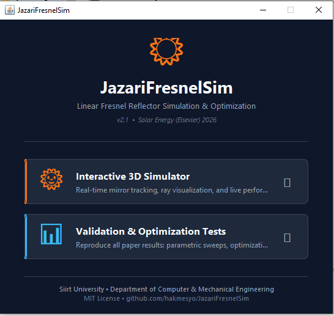

<p align="center">
  
</p>

<h1 align="center">JazariFresnelSim</h1>

<p align="center">
  <b>Rapid Optical–Thermal Simulation & Design Optimization of Linear Fresnel Reflectors</b>
</p>

<p align="center">
  <a href="https://opensource.org/licenses/MIT"></a>
  <a href="https://www.java.com"></a>
  <a href="#"></a>
  <!-- <a href="#citation"></a> -->
</p>

<p align="center">
  <a href="#-quick-start-2-minutes">Quick Start</a> •
  <a href="#-features">Features</a> •
  <a href="#-for-researchers">For Researchers</a> •
  <a href="#-validation">Validation</a> •
  <a href="#citation">Citation</a>
</p>

---

## What is JazariFresnelSim?

JazariFresnelSim is an **open-source analytical simulation framework** for the optical–thermal design of Linear Fresnel Reflector (LFR) concentrated solar power systems. It evaluates complete LFR configurations **over 500× faster** than Monte Carlo ray-tracing tools like SolTrace, enabling:

- **Instant parametric exploration** — sweep thousands of designs in seconds
- **Metaheuristic optimization** — PSO, GA, and SA find optimal geometries in under 3 seconds
- **Dimensionless design rules** — generalized sizing guidelines validated across multiple locations
- **Interactive 3D visualization** — real-time mirror tracking, ray paths, and performance metrics

<p align="center">
  
</p>

> **Accompanying paper:** *"Rapid Optical–Thermal Design of Linear Fresnel Reflectors: An Open-Source Analytical Framework and Dimensionless Sizing Rules"* — submitted to .... , 2026.

---

## 🚀 Quick Start (2 minutes)

### Prerequisites

- **Java 17 or later** — [Download from Oracle](https://www.oracle.com/tr/java/technologies/downloads/)
- Verify installation: open a terminal and type `java -version`

### Option A: Download and Run (easiest — no IDE needed)

1. **Download** the latest release: [**⬇ JazariFresnelSim.zip**](https://github.com/hakmesyo/JazariFresnelSim/releases/latest/download/JazariFresnelSim.zip)
2. **Extract** the ZIP to any folder
3. **Double-click** `JazariFresnelSim.jar` inside the extracted folder
4. The launcher window opens — choose **Interactive 3D Simulator** or **Validation & Optimization Tests**

> **Important:** Do not move the JAR file out of its folder. The `lib/` and `natives/` folders must stay next to it.

<p align="center">
  
</p>

### Option B: Run from terminal

```bash
# Extract and run
unzip JazariFresnelSim.zip
cd JazariFresnelSim

# Launch GUI
java -jar JazariFresnelSim.jar

# Or launch directly in CLI mode (no GUI)
java -jar JazariFresnelSim.jar --cli
```

You will see this menu:

```
================================================================
  JazariFresnelSim — Validation & Optimization Test Suite v2.1
  Paper: Rapid Optical-Thermal Design of LFR Systems
  Journal: ....
================================================================

========== MAIN MENU ==========
  [1] Metaheuristic Optimization (GA, PSO, SA)
  [2] Extreme-Angle Annual Error Analysis
  [3] Temporal Discretization Sensitivity
  [4] Parametric Sweep: Mirror Spacing
  [5] Parametric Sweep: Receiver Height
  [6] Mirror Count Scaling
  [7] Run ALL Tests (comprehensive)
  [8] Generate Convergence Data (Fig. 9)
  [9] Launch Interactive 3D Simulator
  [0] Exit
================================
```

### Option C: Build from source

```bash
git clone https://github.com/hakmesyo/JazariFresnelSim.git
cd JazariFresnelSim
```

Open the project in **NetBeans** (or any Java IDE), set `jazarifresnelsim.JazariLauncher` as the main class, and run. Alternatively, build the JAR and run:

```bash
java -jar dist/JazariFresnelSim.jar
```

---

## ✨ Features

### Analytical Optical–Thermal Engine

| Component | Method | Accuracy |
|-----------|--------|----------|
| Solar position | Spencer 7-term Fourier series | RMSE 0.19° (vs. NREL SPA) |
| Mirror tracking | Bisector-based law of reflection | Max error 0.04° |
| Shading/blocking | 3D vector projection, all pairs | RMSE 0.6 pp (vs. SolTrace) |
| End losses | Bellos et al. analytical formulation | — |
| Spillage | First-order beam-width correction | σ_opt = 4.65 mrad |
| Thermal model | Churchill–Bernstein + radiative loss | Bare tube, 250°C |

### Computational Performance

| Mirrors (N) | Core time | Evaluation rate |
|-------------|-----------|-----------------|
| 6 | 0.18 ms | 60 Hz (with rendering) |
| 10 | 0.30 ms | 60 Hz (with rendering) |
| 48 | 1.31 ms | **700+ Hz (headless)** |

### Optimization Algorithms

Three metaheuristic algorithms with 5-parameter simultaneous optimization:

| Algorithm | Execution time | Best yield | Std. dev. |
|-----------|---------------|------------|-----------|
| Simulated Annealing | 0.58 s | 821.2 kW/m² | 38.8 |
| Genetic Algorithm | 2.71 s | 840.2 kW/m² | 15.4 |
| Particle Swarm (PSO) | 1.80 s | 861.1 kW/m² | 28.8 |

---

## 🔬 For Researchers

### Reproducing Paper Results

Every figure and table in the manuscript can be reproduced from this repository:

| Paper Reference | Menu Option | Output |
|----------------|-------------|--------|
| Table 6 (Extreme-angle analysis) | `[2]` | Console output |
| Table 7 (Mirror count scaling) | `[6]` | Console output |
| Table 10 (Optimization results) | `[1]` | Console output |
| Table 14 (Temporal sensitivity) | `[3]` | Console output |
| Figure 6 (Spacing sweep) | `[4]` | Console output |
| Figure 7 (Height sweep) | `[5]` | Console output |
| Figure 9 (Convergence plot) | `[8]` | CSV files → Python plot |

**To reproduce Figure 9:**

```bash
# Step 1: Generate convergence data (runs 30× each for SA, GA, PSO)
java -jar JazariFresnelSim.jar
# Select option [8], wait ~2.5 minutes

# Step 2: Plot with Python
pip install matplotlib pandas numpy
python scripts/plot_convergence.py
# Output: fig_convergence.pdf
```

The archived CSV files (`convergence_SA.csv`, `convergence_GA.csv`, `convergence_PSO.csv`) are included in the `data/` directory for immediate plotting without re-running the optimization.

### Dimensionless Design Rules

The framework derives three sizing rules validated across Diyarbakır (37.96°N), Berlin (52.52°N), and Jeddah (21.49°N):

| Rule | Formula | Meaning |
|------|---------|---------|
| **Rule 1** | p/w > 2.5 | Shading losses fall below 2% |
| **Rule 2** | H_r/W_f ≈ 1.0 | Energy output peaks; diminishing returns beyond |
| **Rule 3** | N_opt ≈ 0.6 · W_f/p | Optimal mirror count for a given field width |

### Using as a Library

You can integrate the analytical engine into your own Java projects:

```java
import jazarifresnelsim.domain.SolarCalculator;
import jazarifresnelsim.domain.MirrorTracker;
import jazarifresnelsim.domain.ShadingDetector;
import jazarifresnelsim.models.*;

// 1. Calculate solar position for any location and time
SolarCalculator calc = new SolarCalculator(37.96, 40.25, 0);  // lat, lon, alt
SolarPosition sunPos = calc.calculateSolarPosition(
    LocalDateTime.of(2024, 6, 21, 12, 0));

// 2. Compute optimal mirror angles
MirrorTracker tracker = new MirrorTracker();
double angle = tracker.calculateOptimalMirrorAngle(
    mirrorX, sunPos, simulationState);

// 3. Evaluate shading losses
ShadingDetector shading = new ShadingDetector();
double efficiency = shading.calculateBlockingAndShadingLoss(
    mirror, allMirrors, state, sunPos);

// 4. Run full optimization
FresnelDesignProblem problem = new FresnelDesignProblem(
    37.96, 40.25, evaluationTimes);
ParticleSwarm pso = new ParticleSwarm();
DesignSolution best = pso.optimize(problem, initialParams, constraints);
```

### Customizing Parameters

All design parameters can be adjusted programmatically:

```java
DesignParameters params = new DesignParameters(
    130.0,   // receiverHeight (cm) — range: [30, 300]
    16.0,    // receiverDiameter (cm) — range: [10, 50]
    20.0,    // mirrorWidth (cm) — range: [5, 30]
    30.0,    // mirrorSpacing (cm) — range: [20, 70]
    6        // numberOfMirrors — range: [2, 10]
);
```

---

## ✅ Validation

The framework is validated through a 5-level hierarchy:

```
Level 1: Solar Position  ──→  NREL SPA          ──→  RMSE < 0.25°
Level 2: Mirror Tracking ──→  Closed-form        ──→  Error < 10⁻⁶°
Level 3: Mirror Angles   ──→  Barbón et al.      ──→  Max error 0.04°
Level 4: Intercept Factor──→  Santos et al. MCRT  ──→  Agreement to 55°
Level 5: System Optical  ──→  SolTrace (5 geom.) ──→  RMSE 2.1 pp
```

---

## 📁 Project Structure

```
JazariFresnelSim/
├── src/jazarifresnelsim/
│   ├── core/               # Simulation controller & interface
│   ├── domain/             # Analytical engine (stateless, O(N))
│   │   ├── SolarCalculator.java
│   │   ├── MirrorTracker.java
│   │   └── ShadingDetector.java
│   ├── models/             # Immutable data representations
│   ├── optimization/       # PSO, GA, SA + evaluation framework
│   │   ├── algorithms/     # Algorithm implementations
│   │   ├── evaluation/     # Multi-metric design evaluator
│   │   └── problem/        # Design parameter space definition
│   ├── test/               # Validation benchmarks
│   └── ui/                 # Processing-based 3D renderer
├── scripts/
│   └── plot_convergence.py # Python script for Figure 9
├── data/
│   ├── convergence_SA.csv  # Archived optimization data
│   ├── convergence_GA.csv
│   └── convergence_PSO.csv
├── docs/                   # Documentation and screenshots
└── README.md
```

---

## 🛠️ Requirements

| Component | Minimum | Recommended |
|-----------|---------|-------------|
| Java | 17 | 21 |
| RAM | 512 MB | 4 GB |
| GPU | Any (OpenGL 2.0) | Dedicated GPU |
| OS | Windows / macOS / Linux | Any |
| Python (for plots only) | 3.8+ | 3.10+ |

---

## 📖 Citation

If you use JazariFresnelSim in your research, please cite:

```bibtex
@article{demirtas2026jazari,
  author  = {Demirta{\c{s}}, Yunus and Ata{\c{s}}, Musa},
  title   = {Rapid Optical--Thermal Design of Linear Fresnel Reflectors: 
             An Open-Source Analytical Framework and Dimensionless Sizing Rules},
  journal = {......},
  year    = {2026},
  note    = {Submitted},
  url     = {https://github.com/hakmesyo/JazariFresnelSim}
}
```

---

## 📜 License

This project is licensed under the [MIT License](LICENSE) — free for academic and commercial use.

---

## 🤝 Contributing

Contributions are welcome! Areas where help is particularly appreciated:

- **Gaussian optical error model** — replacing the collimated-ray assumption with sunshape convolution
- **Secondary optics (CPC)** — analytical acceptance-angle model for compound parabolic concentrators
- **Non-uniform mirror spacing** — exposing per-mirror positions as optimization variables
- **Python API wrapper** — enabling integration with the Python scientific computing ecosystem

Please open an issue or pull request on GitHub.

---

## 📧 Contact

- **Musa Ataş** (Corresponding Author) — [musa.atas@siirt.edu.tr](mailto:musa.atas@siirt.edu.tr)
- **Yunus Demirtaş** — [yunusdemirtas@siirt.edu.tr](mailto:yunusdemirtas@siirt.edu.tr)

Department of Computer Engineering & Mechanical Engineering, Siirt University, Turkey